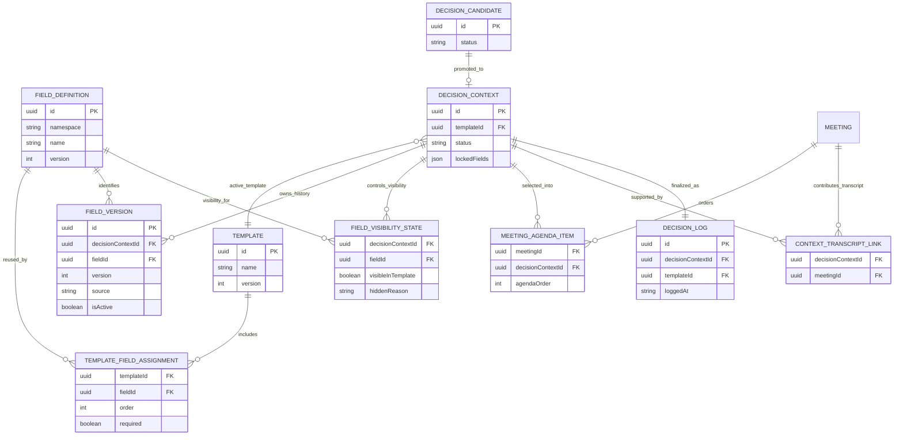
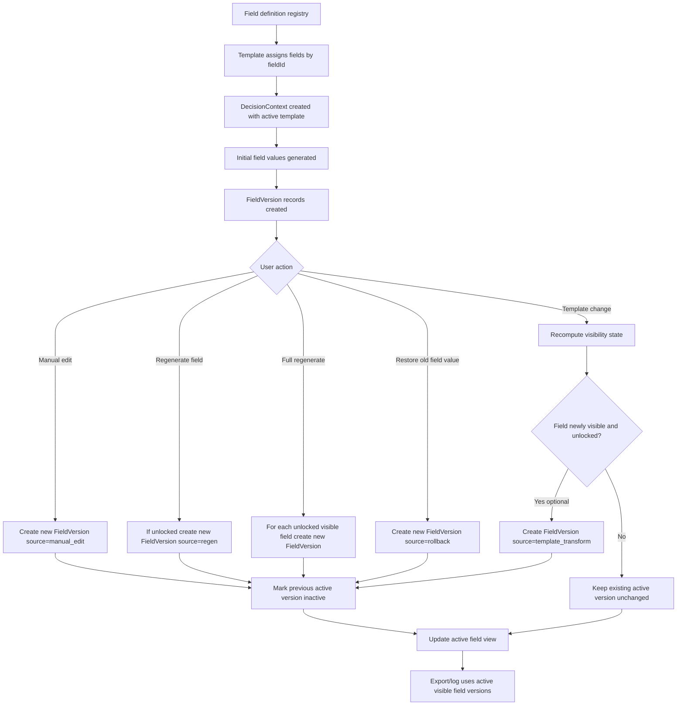

# Field, Template, and Versioning Model Explainer

**Status**: explanatory
**Related authoritative docs**: `docs/versioning-architecture.md`, `docs/plans/iterative-implementation-plan.md`
**Related proposal docs**: `docs/plans/field-versioning-schema-proposal.md`, `docs/plans/field-versioning-api-proposal.md`
**Purpose**: explain how fields, templates, versions, locks, rollback, and template changes should work together in practice

## Why this document exists

The authoritative architecture already establishes that the long-term model is **field-centric versioning**, not whole-draft snapshot versioning.

This document expands that model with:

- a shared mental model
- a Mermaid diagram
- strategy alternatives and tradeoffs
- concrete examples
- decision rules for tricky cases
- explicit answers to common questions:
  - how locked fields affect versions
  - whether restoring a field creates a new decision version
  - whether template change counts as a new version

## Recommended model

The recommended model is:

- **Fields** are reusable definitions with stable identity.
- **Templates** are curated views over fields.
- **DecisionContext** is the working container for one draft of one decision.
- **FieldVersion** is the canonical history record.
- **FieldVisibilityState** determines whether a field participates in the active template view.
- **DecisionLog** is the immutable finalized output, derived from the active field state at completion time.
- **DecisionCandidate** is a detected or flagged possible decision that remains separate until promoted.
- **Meeting agenda** is an ordered selection of open decision contexts, not the owner of those contexts.

This means:

- a decision does **not** primarily version as one giant document
- each field versions independently inside one `DecisionContext`
- each `DecisionContext` binds to a specific template definition version and its resolved field-definition set at creation time
- one `DecisionContext` may accumulate work from multiple meetings before finalization
- meetings select from open decision contexts for agenda management
- automatically detected candidates do **not** become decision contexts until explicitly promoted
- transcript evidence from many meetings may accumulate against one context
- template changes mostly affect **visibility and interpretation**, not historical deletion
- rollback is modeled as **restore by creating a new version**, not by mutating history
- finalization produces a meeting/event-specific `DecisionLog`, not a new long-running workspace

## Core concepts

### Field definition

A field definition describes a reusable slot of meaning.

Examples:

- `decision_statement`
- `options_considered`
- `risks`
- `owner`
- `due_date`

Field definitions should have stable identity via:

- `id` for internal references
- `namespace + name + version` for stable programmatic identity

A field definition is not a value. It is the schema for a value.

### Template

A template selects and presents fields for a use case.

A template may:

- include a subset of fields
- order them
- mark some as required
- customize labels/descriptions

A template should **reuse fields by `fieldId`** rather than duplicating field definitions.

A template is therefore a view/composition layer, not the canonical owner of field history.

### DecisionContext

A `DecisionContext` is the live editing workspace for a single decision draft.

It is not necessarily limited to one meeting.

It may carry work across:

- multiple meetings discussing the same pending decision
- asynchronous preparation between meetings
- preparation work that happens outside formal meeting scope

Meetings may place an existing open context onto an ordered agenda without becoming the owner of that context.

It owns:

- the active template reference
- the active template definition version binding
- active/locked field state
- transcript associations and guidance context
- field visibility state
- field version history within that context

It may also be associated with transcript evidence from many meetings.

It does not own field-definition or template-definition editing.

Those configuration artifacts are managed independently and may later publish new versions without automatically changing already-open contexts.

Think of it as:

- one decision draft
- many fields
- each field with its own timeline

### DecisionCandidate

A `DecisionCandidate` is not the same as a `DecisionContext`.

Candidates come from:

- automatic detection
- manual flagging

Candidates remain lightweight review items until explicitly promoted.

Promotion is the step where:

- the candidate becomes an actively managed decision topic
- a `DecisionContext` is created or linked
- the topic becomes eligible for ordered meeting agendas

### DecisionLog

A `DecisionLog` is different from a `DecisionContext`.

`DecisionContext` is the ongoing workspace.

`DecisionLog` is the immutable record of the actual decision event.

That final log should be tied to:

- the specific moment the decision was taken
- the meeting or event context in which it was finalized
- the participant set with authority to make the decision at that moment
- the active visible field values at finalization time

That participant list is not the same thing as the full contributor set.

Contributor history can be inferred from transcript relations if needed.

### FieldVersion

`FieldVersion` is the canonical record of value history.

Each version should capture at least:

- `decisionContextId`
- `fieldId`
- monotonically increasing `version`
- `value`
- `source`
- provenance metadata where available
- `createdAt`
- `createdBy` when applicable
- `isActive`

Recommended `source` values:

- `ai_generated`
- `manual_edit`
- `regen`
- `template_transform`
- `rollback`

## Context creation and template-version binding

When a `DecisionContext` is created:

1. choose a specific template definition version
2. resolve the field-definition set referenced by that template version
3. bind the context to that template/version combination
4. initialize visibility/working state for the resolved field set

This does not mean copying field-library configuration into the context as editable template metadata.

Instead, it means the context pins the configuration it is using for drafting while keeping field/template management outside the context lifecycle.

If the context later adopts a newer version of the same template definition, that should be treated as an explicit template migration using the same semantics as any other template change:

- update the active template version binding
- recompute visibility
- preserve values
- optionally transform or regenerate unlocked fields when needed
- avoid writing synthetic field versions for unchanged values

## Relationship model

## Lifecycle model

## Versioning rules

## Rule 1: version fields independently

Each field gets its own version counter within one `DecisionContext`.

Example:

- `decision_statement`: versions 1, 2, 3
- `risks`: versions 1, 2
- `owner`: version 1

This is better than whole-draft versioning because:

- one field can change without implying every field changed
- field history stays auditable
- restore is local and precise
- lock semantics are easier to enforce

## Rule 2: append-only history

History should never be rewritten.

Any meaningful state change creates a new record and marks the old active version inactive.

This applies to:

- manual edits
- regenerate
- rollback restore
- optional template-driven transforms

## Rule 3: template changes are usually not value changes

A template change should not automatically mean every field gets a new version.

Instead, template change should usually do this:

- update `DecisionContext.templateId`
- recompute `FieldVisibilityState`
- keep all existing field versions intact
- only create new `FieldVersion` records if an actual field value is transformed or regenerated

This keeps template change semantic and cheap.

## Rule 4: visibility is separate from value history

A hidden field still exists.

Hidden means:

- not shown in the active template view
- not exported
- not considered for active-template required checks

Hidden does **not** mean:

- deleted
- forgotten
- removed from history

## Rule 5: locks prevent specific kinds of new versions

A locked field should block any system-initiated value change.

At minimum, locked fields should not receive new versions from:

- field regenerate
- full regenerate
- template transform

Recommended stricter rule:

- locked fields should also reject manual edit unless the user explicitly unlocks first

If you want softer locking semantics, define that clearly. Two viable options are below.

## Lock strategies

### Strategy A — Hard lock everywhere

A locked field rejects:

- regenerate
- template transform update
- manual edit
- rollback restore

Pros:

- strongest invariants
- easiest mental model
- avoids accidental mutation

Cons:

- can feel rigid for users
- rollback may require annoying unlock/relock flow

### Strategy B — Protect against automated changes only

A locked field rejects:

- regenerate
- full regenerate
- template transform writes

A locked field still allows:

- manual edit
- rollback restore

Pros:

- preserves user agency
- matches a common interpretation of lock as “protect from AI/system churn”

Cons:

- slightly more nuanced model
- needs explicit docs and UI cues

### Recommendation

Use **Strategy B**.

Reason:

- most teams lock a field to stop AI churn, not to permanently freeze the user out
- manual correction and rollback are user-controlled actions
- template-driven auto-change should still be blocked

If you choose Strategy B, document this invariant explicitly:

- **Locked fields may only change through explicit user intent, never through automated generation or template transform.**

## Worked examples

### Example 1 — Manual edit

Context uses template `Standard Decision`.

Initial versions:

- `decision_statement` v1 = "Approve migration in Q3" (`ai_generated`)
- `risks` v1 = "Timeline risk" (`ai_generated`)

User edits `decision_statement`.

Result:

- `decision_statement` v2 = "Approve migration in Q4 after review" (`manual_edit`)
- v1 remains historical and inactive
- `risks` unchanged

Decision-level result:

- same `DecisionContext`
- no new top-level decision object yet
- active field state changed

### Example 2 — Regenerate one field while another is locked

Current state:

- `decision_statement` locked
- `risks` unlocked

User runs full regenerate.

Result:

- `decision_statement` gets no new version
- `risks` gets v2 with `source='regen'`

This is expected. Locks are per-field, not whole-context, unless you explicitly introduce a separate context lock.

### Example 3 — Template change with overlapping fields

Old template includes:

- `decision_statement`
- `risks`
- `owner`

New template includes:

- `decision_statement`
- `owner`
- `due_date`

After template change:

- `decision_statement` stays visible
- `owner` stays visible
- `risks` becomes hidden, but its version history remains
- `due_date` becomes visible with no value yet, or gets an initial generated/transformed value if you choose to do that

Only if you actually populate or transform `due_date` should you create a new `FieldVersion`.

### Example 4 — Roll back one field

`decision_statement` history:

- v1 = "Approve migration in Q3"
- v2 = "Approve migration in Q4"
- v3 = "Delay migration until budget approval"

User restores v1.

Recommended result:

- create `decision_statement` v4 = "Approve migration in Q3" with `source='rollback'`
- do not reactivate v1 directly

Why:

- audit trail stays append-only
- the system records that a restore happened now
- provenance is preserved

## Direct answers to the key questions

### How do locked fields impact versions?

Locked fields should prevent **automatic** creation of new versions.

At minimum, a locked field must not receive new versions from:

- `regen`
- full regenerate
- template-transform writes

Recommended behavior:

- allow explicit user actions like manual edit and rollback restore
- reject system-driven changes while locked

This yields deterministic behavior:

- AI cannot overwrite a user-protected field
- template change cannot mutate a protected field
- the user can still intentionally correct or restore it

### Does rolling back a field create a new version of the decision?

**Not by default.**

Recommended answer:

- rolling back a field creates a **new `FieldVersion`** for that field
- it does **not** create a new top-level decision object
- it does change the active state of the `DecisionContext`

If you later introduce a separate concept like `DecisionRevision`, then a field restore could optionally increment that revision. But that should be a **derived aggregate revision**, not the canonical history model.

Best rule:

- canonical history = `FieldVersion`
- optional convenience revision = derived from context changes if needed for UX

### Does template change equal a new version?

**Usually no, not by itself.**

Recommended answer:

- changing the active template updates context/template/visibility state
- it does not automatically create new field versions
- it only creates new field versions when actual field values change

So:

- template switch alone = metadata/state change
- template switch plus generated/transformed values = version changes for the affected fields only

This distinction is important. Otherwise every template switch would flood history with synthetic versions even when values did not change.

## Possible strategies for “decision version” semantics

There are three common strategies.

### Strategy 1 — No explicit decision version

Use only:

- `DecisionContext`
- `FieldVersion`
- optional immutable `DecisionLog` at finalize time

Pros:

- simplest
- matches the architecture best
- avoids duplicate concepts

Cons:

- less convenient for UIs that want one obvious “draft revision number”

### Strategy 2 — Derived context revision

Add a derived `contextRevision` counter that increments whenever active field state changes.

This is not the canonical history, only a convenience view.

Pros:

- easier UX for “last changed draft revision”
- helps auditing and event feeds

Cons:

- can be confused with real version history if not documented well

### Strategy 3 — Snapshot revision as compatibility wrapper

Keep existing whole-draft snapshots for migration and compatibility, but treat them as wrappers over field history.

Pros:

- smooth migration
- easier support for legacy rollback endpoints

Cons:

- dual-write complexity
- temporary duplication
- divergence risk

### Recommendation

Use a combination of:

- **Strategy 1** as the canonical architecture
- **Strategy 3** during migration
- optionally **Strategy 2** later if UX needs a human-friendly revision counter

## Potential issues and failure modes

### Ambiguous field identity

If user-facing flows refer only to field name, ambiguity can appear when:

- multiple namespaces exist
- multiple field-definition versions exist
- custom fields shadow core fields

Mitigation:

- prefer UUID internally
- allow stable field-name reference only as a convenience layer
- expand to `namespace + name + version` where ambiguity becomes realistic

### Dual-write divergence

During migration, one write path may succeed and the other fail.

Examples:

- `draft_data` updated but `FieldVersion` insert fails
- `FieldVersion` insert succeeds but snapshot compatibility write fails

Mitigation:

- wrap both writes in one transaction when possible
- add parity assertions in tests
- emit explicit alerts/logs on divergence

### Hidden field confusion

Users may assume a hidden field is gone forever.

Mitigation:

- make hidden/recoverable semantics visible in UI and docs
- support “show hidden fields” or history views

### Lock confusion

Users may not know whether lock blocks AI only or all edits.

Mitigation:

- choose one lock model and document it everywhere
- use clear labels such as:
  - “Protected from AI updates”
  - or “Fully locked”

### Template transform surprises

A template change that silently rewrites values can feel dangerous.

Mitigation:

- make transform behavior explicit
- default to visibility-only template changes
- require explicit confirmation for transform/regenerate side effects

### Rollback semantics confusion

People often expect rollback to “move time backward”.

In an append-only model, rollback means:

- replay an old value as a new active version now

Mitigation:

- use language like “restore this value as the current version”
- show provenance clearly

## Recommended decision rules

If you want a crisp operating policy, use this:

1. **Field versions are the canonical history model.**
2. **Template changes update visibility first, values second.**
3. **A field restore creates a new `FieldVersion` with `source='rollback'`.**
4. **Locked fields block automated writes.**
5. **Template change alone does not equal a new field version.**
6. **Decision-level rollback is a compatibility wrapper over field restore behavior.**
7. **Exports and finalization use active visible field versions only.**
8. **Whole-draft snapshots remain migration-only compatibility state.**

## Suggested API/CLI implications

### Field history APIs

Examples:

- `GET /api/decision-contexts/:id/fields/:fieldRef/versions`
- `GET /api/decision-contexts/:id/fields/:fieldRef/versions/:version`
- `POST /api/decision-contexts/:id/fields/:fieldRef/restore`

### CLI examples

- `draft field-history <field-name>`
- `draft show-field-version <field-name> --version 3`
- `draft restore-field <field-name> --version 1`

### Behavior notes

- `fieldRef` may be UUID internally, stable name as a convenience externally
- restore should create a new active version, not mutate an old record
- hidden fields may still be restorable even when not in the active template

## Migration guidance

### Phase A

Introduce:

- `FieldVersion`
- `FieldVisibilityState`

Do not remove:

- `draft_data`
- `draft_versions`

### Phase B

Dual-write on:

- manual edit
- field regenerate
- full regenerate

Add parity tests between:

- active snapshot value
- active field-version value

### Phase C

Switch reads for UI/API/CLI to:

- active visible `FieldVersion`

Retain snapshot fallback temporarily.

### Phase D

Convert decision rollback semantics into:

- multi-field restore orchestration
- compatibility wrapper behavior for old snapshot endpoints

## Final recommendation

If the goal is to “get this bit right,” the most stable and comprehensible rule set is:

- **FieldVersion is canonical**
- **visibility is separate from value**
- **rollback creates a new field version**
- **template change alone is not a new value version**
- **locks block automated writes, not necessarily explicit user intent**
- **decision-level versions are optional convenience semantics, not the source of truth**

That gives you:

- strong auditability
- safe template evolution
- clear rollback semantics
- deterministic lock behavior
- a migration path from snapshots without committing to snapshot-centric architecture
